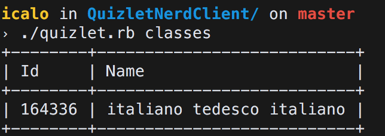
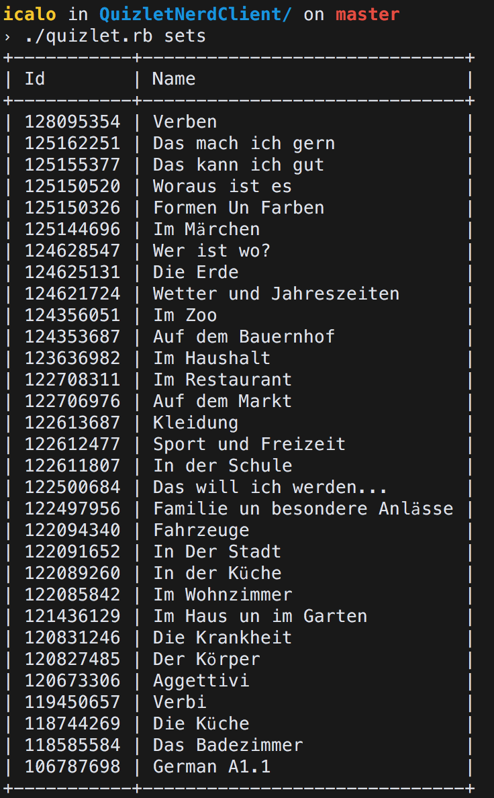
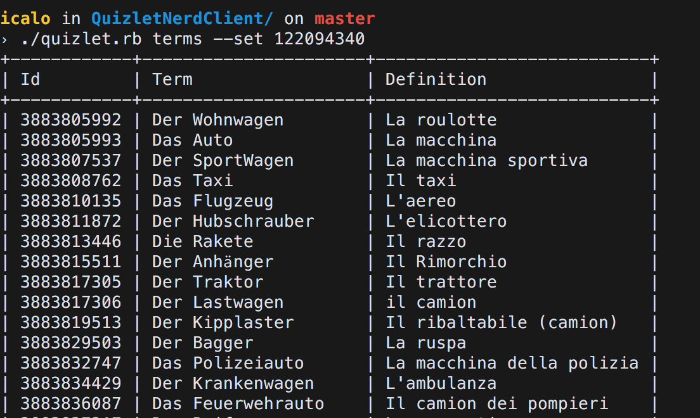

#Quizlet Nerd Client

This is a (bad) **unofficial** command line client for Quizlet.com

The current version offer this functionalities:

* Login
* Get list of classes
* Get list of sets
* Get list of terms for a specific set
* Add a new term to a specific set.

## Installation

Or install it yourself as:

    $ gem install QuizletNerdClient

## How to use:

1. Sign up on Quizlet.com *(you should already have an account...it's free!!!)*
2. Go to the API documentation and create your own app.
3. Copy your `client id` and your `app secret`.
4. Initialize the Quizlet Nerd Client running this command: `./quizlet.rb init --client_id xxxx --app_secret yyyy` (Replace `xxxx` and `yyyy` with your data)
5. Authorize the script running this command: `./quizlet.rb login`
6. Interact with the api, for example you can run `./quizlet.rb sets`
6. Enjoy.

## About the login
The login is not done entirely via the command line, but the script opens a special url where the user can login and authorize the script. (because of the OAUTH2).

## What is missing?
Basically everything 😂.
There is no error management and no security check, and 90% of the api calls are not implemented yet.

## Screenshots
###List of classes:

###List of sets:

###List of terms:

## Development

After checking out the repo, run `bin/setup` to install dependencies. Then, run `rake test` to run the tests. You can also run `bin/console` for an interactive prompt that will allow you to experiment.

To install this gem onto your local machine, run `bundle exec rake install`. To release a new version, update the version number in `version.rb`, and then run `bundle exec rake release`, which will create a git tag for the version, push git commits and tags, and push the `.gem` file to [rubygems.org](https://rubygems.org).

## Contributing

Bug reports and pull requests are welcome on GitHub at https://github.com/[USERNAME]/QuizletNerdClient.

## License

The gem is available as open source under the terms of the [MIT License](http://opensource.org/licenses/MIT).
